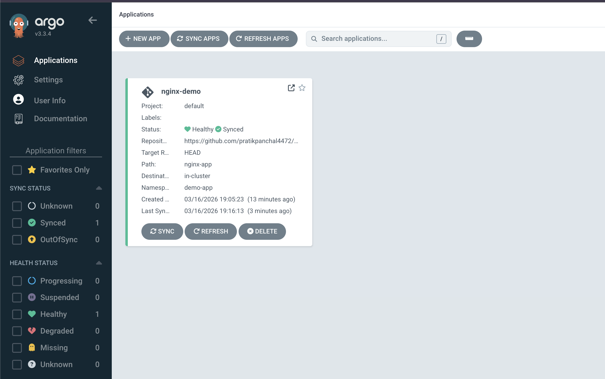
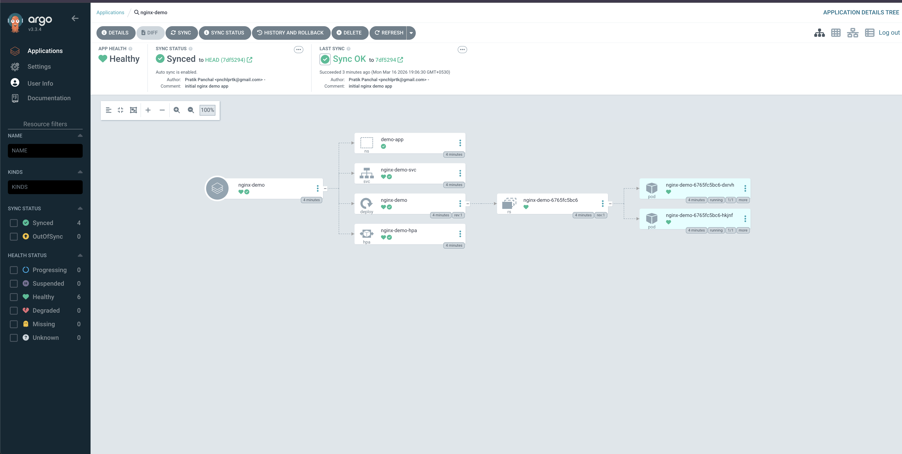
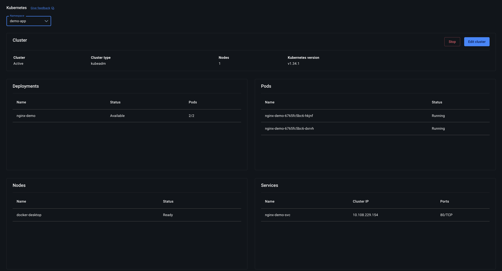
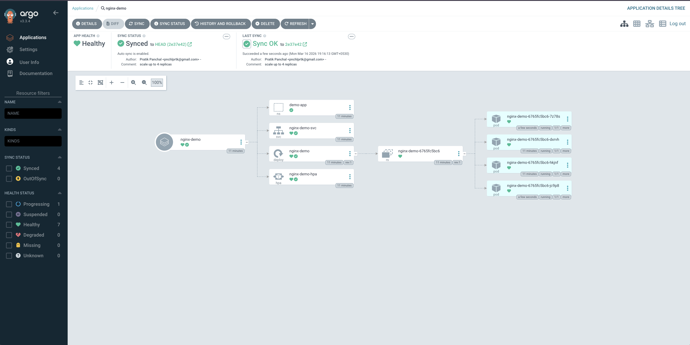
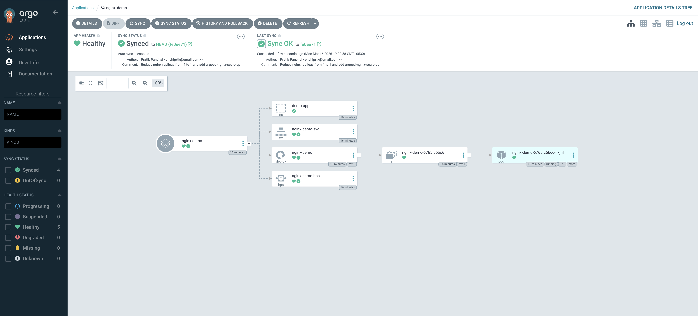

# ArgoCD Demo — GitOps on Docker Desktop Kubernetes

A hands-on walkthrough of ArgoCD's GitOps loop using a public nginx demo app on a local Docker Desktop Kubernetes cluster. Covers installation, app deployment, manual scaling, HPA auto-scaling, and rollback — all driven by `git commit`.

---

## Prerequisites

- **Docker Desktop** with Kubernetes enabled
  - Docker Desktop → Settings → Kubernetes → ✅ Enable Kubernetes → Apply & Restart
- **kubectl** (bundled with Docker Desktop)
- **Homebrew** (for ArgoCD CLI)
- A **public GitHub repository** to host the manifests (this repo)

Verify your cluster is ready:

```bash
kubectl config current-context
# Expected: docker-desktop

kubectl get nodes
# Expected: docker-desktop   Ready
```

---

## Step 1 — Install ArgoCD

```bash
kubectl create namespace argocd

kubectl apply -n argocd -f https://raw.githubusercontent.com/argoproj/argo-cd/stable/manifests/install.yaml

# Wait for all pods to be ready (~2 min)
kubectl wait --for=condition=ready pod --all -n argocd --timeout=300s

kubectl get pods -n argocd
```

Expected pods: `argocd-server`, `argocd-repo-server`, `argocd-application-controller`, `argocd-dex-server`, `argocd-redis` — all `Running`.

---

## Step 2 — Expose ArgoCD UI Locally

```bash
kubectl port-forward svc/argocd-server -n argocd 8080:443
```

Leave this running. ArgoCD UI is now at **https://localhost:8080** (accept the self-signed cert warning).

Get the initial admin password:

```bash
kubectl get secret argocd-initial-admin-secret -n argocd \
  -o jsonpath="{.data.password}" | base64 -d && echo
```

Login with: `admin` / `<password from above>`

---

## Step 3 — Install ArgoCD CLI

```bash
brew install argocd

argocd login localhost:8080 \
  --username admin \
  --password $(kubectl get secret argocd-initial-admin-secret -n argocd -o jsonpath="{.data.password}" | base64 -d) \
  --insecure
```

---

## Step 4 — App Manifests (this repo)

The [`nginx-app/`](nginx-app/) directory contains all Kubernetes manifests:

| File | Purpose |
|---|---|
| `namespace.yaml` | Creates the `demo-app` namespace |
| `deployment.yaml` | nginx demo app (`nginxdemos/hello:latest`), 1 replica |
| `service.yaml` | `NodePort` Service on port 80 |
| `hpa.yaml` | HPA: 1–6 replicas at 50% CPU |

---

## Step 5 — Create the ArgoCD Application

No credentials needed for a public repo — reference it directly:

```bash
argocd app create nginx-demo \
  --repo https://github.com/<your-username>/argocd-demo \
  --path nginx-app \
  --dest-server https://kubernetes.default.svc \
  --dest-namespace demo-app \
  --sync-policy automated \
  --auto-prune \
  --self-heal
```

> **`--sync-policy automated`** — ArgoCD polls every ~3 minutes and auto-syncs any Git changes.
> **`--self-heal`** — manual `kubectl` changes are reverted back to Git state.
> **`--auto-prune`** — resources removed from Git are deleted from the cluster.

---

## Step 6 — Sync & Verify

```bash
argocd app sync nginx-demo
argocd app get nginx-demo
```

In the ArgoCD UI you'll see the app as **Healthy + Synced** with a visual resource graph:





Access the nginx demo app:

```bash
kubectl port-forward svc/nginx-demo-svc -n demo-app 8888:80
```

Open **http://localhost:8888** — you'll see the `nginxdemos/hello` web UI with pod hostname, IP, and request info.

You can also verify via Docker Desktop's Kubernetes dashboard:



---

## Step 7 — Scaling Demos

All scaling is done via Git. ArgoCD detects the change and syncs automatically (or use `argocd app sync nginx-demo` to trigger immediately).

### A) Scale Up

```bash
sed -i '' 's/replicas: 1/replicas: 4/' nginx-app/deployment.yaml
git add . && git commit -m "scale up to 4 replicas"
git push
argocd app sync nginx-demo   # optional — auto-syncs within ~3 min
```

Watch pods come up:

```bash
kubectl get pods -n demo-app -w
```

ArgoCD UI after scale-up — 4 pods running:



### B) Scale Down

```bash
sed -i '' 's/replicas: 4/replicas: 1/' nginx-app/deployment.yaml
git add . && git commit -m "scale down to 1 replica"
git push
argocd app sync nginx-demo
```



### C) HPA Auto-scaling

The `hpa.yaml` already deployed handles automatic scaling between 1–6 replicas based on CPU:

```bash
kubectl get hpa -n demo-app
```

### D) Rollback via ArgoCD

**UI:** ArgoCD → `nginx-demo` → **History and Rollback** → select a revision → **Rollback**

**CLI:**
```bash
argocd app history nginx-demo
argocd app rollback nginx-demo <REVISION_NUMBER>
```

---

## Step 8 — Image Update Demo

```bash
sed -i '' 's|nginxdemos/hello:latest|nginxdemos/hello:plain-text|' \
  nginx-app/deployment.yaml
git add . && git commit -m "update image to plain-text variant"
git push
argocd app sync nginx-demo
```

ArgoCD performs a rolling update with zero downtime.

---

## Quick Reference

| Action | Command |
|---|---|
| Check app status | `argocd app get nginx-demo` |
| Force sync | `argocd app sync nginx-demo` |
| List apps | `argocd app list` |
| Watch pods | `kubectl get pods -n demo-app -w` |
| Check HPA | `kubectl get hpa -n demo-app` |
| Delete app | `argocd app delete nginx-demo` |
| ArgoCD UI | https://localhost:8080 |
| App UI | http://localhost:8888 (after port-forward) |

---

## Key Concepts

- **GitOps loop** — Git is the source of truth; ArgoCD watches and auto-syncs to the cluster
- **Self-heal** — manual `kubectl scale` is reverted to match Git state
- **Auto-prune** — resources deleted from Git are deleted from the cluster
- **HPA** — Kubernetes-native auto-scaling layered on top, also managed via ArgoCD
- **Rollback** — point to any prior Git revision via the UI or CLI
